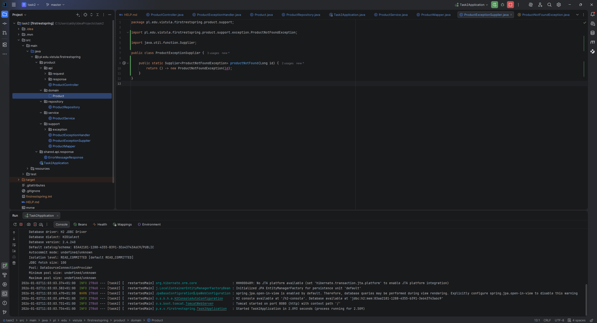
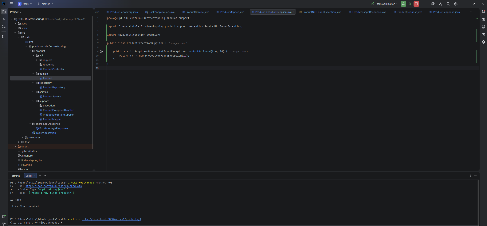
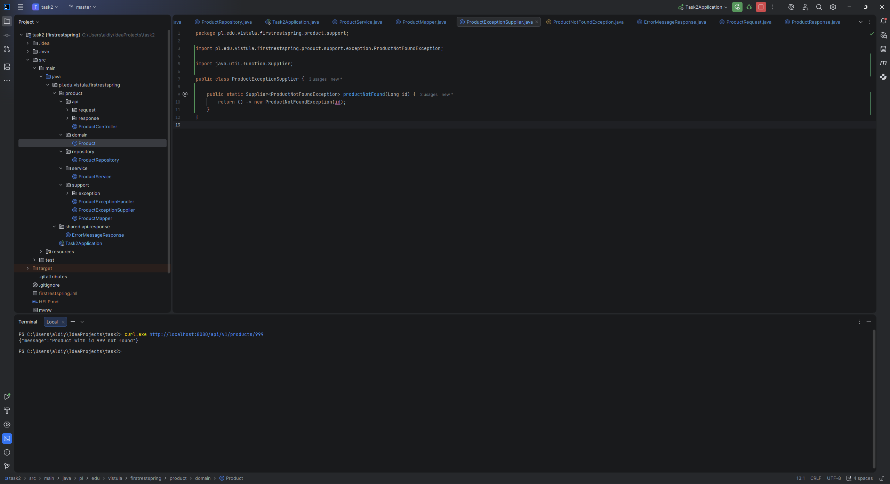

# Task 2 – REST API (Spring Boot)

This project is a simple REST API created using Spring Boot as part of Task 2.

---

## Description
The application allows creating and retrieving products using HTTP requests.
It follows a layered architecture and provides proper exception handling.

---

## Technologies
- Java
- Spring Boot
- Maven

---

## Project Structure

```text
src/main/java/pl/edu/vistula/firstrestspring
 └── product
     ├── api
     │   ├── request
     │   │   └── ProductRequest.java
     │   ├── response
     │   │   └── ProductResponse.java
     │   └── ProductController.java
     ├── domain
     │   └── Product.java
     ├── repository
     │   └── ProductRepository.java
     ├── service
     │   └── ProductService.java
     └── support
         ├── exception
         │   └── ProductNotFoundException.java
         ├── ProductExceptionHandler.java
         ├── ProductExceptionSupplier.java
         └── ProductMapper.java
 └── shared
     └── api
         └── response
             └── ErrorMessageResponse.java
```

API Endpoints
Create product

POST /api/v1/products

Request body:
```text
{
  "name": "My first product"
}
```
Response:
```text
{
  "id": 1,
  "name": "My first product"
}
```
Status: 201 Created

Get product by id

GET /api/v1/products/{id}

Response:
```text
{
  "id": 1,
  "name": "My first product"
}
```
Status: 200 OK

Product not found
If the product does not exist:

Response:
```text
{
  "message": "Product with id X not found"
}
```
Status: 404 Not Found
Screenshots
Application startup

The application successfully starts on port 8080.

Create product (POST request)

Product creation tested using PowerShell.

Get product by id (GET request)

Product successfully retrieved by ID.

Testing

The API was tested using PowerShell with Invoke-RestMethod and curl.

## Screenshots

### Application startup
The application is successfully started and running on port 8080.



---

### Create product (POST request)
A product is created using a POST request with JSON payload.



---

### Get product by id (GET request)
The created product is successfully retrieved using its identifier.



Author

Student of Vistula University
Aldiyar Zhalgas 73259

